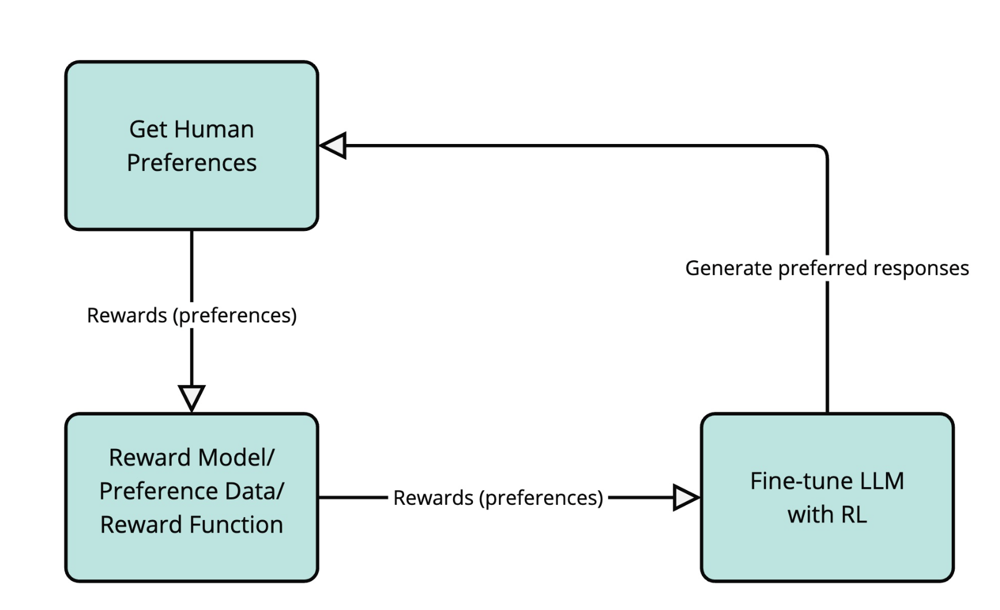

# Reinforcement Learning(RL) for LLM

RL is employed to train LLM so that we can reduce its endesirable behaviours and make the response
more aligned to human preferences. 

One common technique employed is the Reinforcement Learning from Human Feedback(RLHF). In general,
human feedback is collected and used to train a reward model that simulates human preferences. Model is
then tuned with this new reward model. The new model then generates new better responses for human to 
score. The image illustrates the idea:

There are several types of algorithm for RLHF such as:

- [Proximal Policy Optimization(PPO)](https://huggingface.co/docs/trl/main/en/ppo_trainer)
- [Direct Preference Optimization(DPO)](https://huggingface.co/docs/trl/main/en/dpo_trainer)
- Group Relative Policy Optimization(GRPO)

