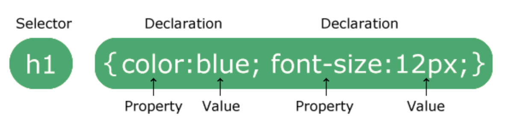
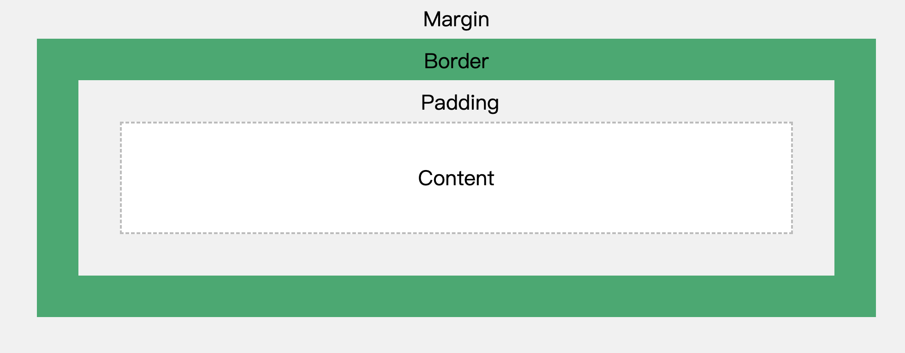

# Cascading Style Sheets (CSS)

## 1) Syntax



You begin with a selector, which specifies the HTML element(s) you want to style. Then, you define a declaration block, which contains one or more declarations separated by semicolons. Each declaration consists of a property and a value, separated by a colon.

Comments in CSS are as follows: `/* comment */`

## 2) CSS Selectors

Selectors are used to find the HTML elements you want to style. It can be 
divided into 5 categories:

1. Simple selectors: element, class, id, universal selector.
2. Combinator selectors: descendant, child, adjacent sibling, general sibling.
3. Pseudo-class selectors: link, visited, hover, active, nth-child, etc
4. Pseudo-element selectors: before, after, first-letter, first-line, etc.
5. Attribute selectors: select elements based on an attribute or attribute value.

`*` selects all elements. It is called universal selector.

## 3） How to link CSS to HTML

1. Inline CSS: use the `style` attribute in an HTML element to apply CSS directly to that element.
2. Internal CSS: use a `<style>` element within the `<head>` section of your
3. External CSS: create a separate CSS file and link it to your HTML document using the `<link>` element.

```html
<!-- External CSS -->
<link rel="stylesheet" href="styles.css">
<!-- Internal CSS -->
<style>
  body {
    background-color: lightblue;
  }
</style>
<!-- Inline CSS -->
<p style="color: red;">This is a red paragraph.</p>
``` 
Note: do not add a space between the property value and the unit. For example, `font-size: 16px;` is correct, while `font-size: 16 px;` is incorrect.

When multiple CSS rules apply to the same element, the order is as follows:

1. Inline styles (highest priority)
2. External and internal style sheets
   1. These 2 have the same priority. If there are conflicting rules, the one that appears last in the CSS will take precedence.
3. Browser default styles (lowest priority)

This is known as the **Cascading order** of CSS.

## 4) Box Model

The image below illustrates the CSS box model. 



- Content: The content of the box, where text and images appear.
- Padding: Clears an area around the content. The padding is tranparent
- Border: A border that goes around the padding and content. The border can be styled with different widths, colors, and patterns.
- Margin: Clears an area outside the border. The margin is also transparent.

**Important**: When you set the width and height of an element, you are only setting the content area. The total width of an element is the sum of the content width, padding, border, and margin. Similarly, the total height is the sum of the content height, padding, border, and margin.

```css
/* Example of box model properties */
div {
  width: 200px; /* content width */
  height: 100px; /* content height */
  padding: 20px; /* adds 40px to total width (20px on each side) */
  border: 5px solid black; /* adds 10px to total width (5px on each side) */
  margin: 10px; /* adds 20px to total width (10px on each side) */
}
```

With the above CSS,
$$ 
total width = content width + padding + border + margin = 200 + 40 + 10 + 20 = 270px.
$$

$$
total height = content height + padding + border + margin = 100 + 40 + 10 + 20 = 170px.
$$

## 5) Flexible Box

Flex box 

## Common errors

1. Forgetting to close a declaration with a semicolon `;`.
2. Invalid property names or values.
   1. For example, `with: -100px` is incorrect, while `width: 100px;` is correct. (Spelling of width is wrong and the value is invalid for the first one)

## Misc 

px stands for pixels, which is a unit of measurement in CSS. It is a relative unit that is based on the screen resolution. One pixel is equal to one dot on the screen. The actual size of a pixel can vary depending on the device and its display settings.

There are absolute units such as `cm`, `mm`, `in`, `pt`, and `pc`, which are based on physical measurements. However, these units are not commonly used in web design because they do not adapt well to different screen sizes and resolutions.

