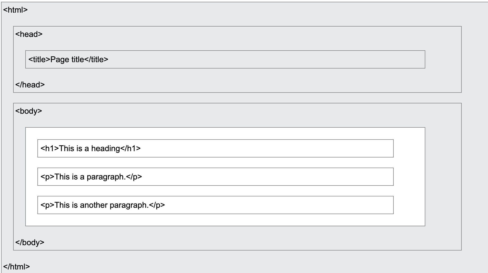

# HTML

## 1) Page Skeleton

```html
<!DOCTYPE html>
<html lang="en">
  <head>
    <meta charset="UTF-8" />
    <meta name="viewport" content="width=device-width, initial-scale=1.0" />
    <title>Page Title</title>
  </head>
  <body>
    <h1>Hello</h1>
  </body>
</html>
```

Reference structure:



## 2) Core Content Tags

- Headings: `<h1>` to `<h6>`
- Text: `<p>`, `<strong>`, `<em>`, `<br>`
- Containers: `<div>` (block), `<span>` (inline)
- Lists: `<ul>`, `<ol>`, `<li>`
- Code: `<code>`, `<pre>`

An HTML **element** is defined by a start tag, content, and an end tag.

## 3) High-Value Attributes

- `id`: unique element identifier
- `class`: reusable styling/JS hook
- `href`: link target (`<a>`)
- `src`, `alt`, `width`, `height`: media (``, `<video>`, etc.)
- `style`: inline CSS (use sparingly)
- `title`: tooltip/extra info
- `lang`: page language on `<html>`

```html
<a href="https://example.com" title="Go to Example">Visit</a>

```

## 4) Links, Media, and Tables

```html
<a href="/about">About</a>
<a href="#faq">Jump to FAQ</a>


<table>
  <tr><th>Name</th><th>Score</th></tr>
  <tr><td>Alice</td><td>95</td></tr>
</table>
```

## 5) Paragraphs

- `<p>` defines a paragraph; each paragraph starts on a new line and browsers add default margin around it.
- In normal HTML text, extra spaces and line breaks in source code are collapsed by the browser.
- Use `<br>` for a single line break without starting a new paragraph.
- Use `<hr>` for a thematic break between sections.
- Use `<pre>` when you need spaces and line breaks preserved.

```html
<p>This is a paragraph.</p>
<p>This is another paragraph.</p>
<p>This is<br>one paragraph<br>with line breaks.</p>
<hr />
<pre>
  Keeps spaces
  and line breaks
</pre>
```

## 6) Tables

- Use `<table>` for tabular data (rows + columns), not for page layout.
- Row: `<tr>`, header cell: `<th>`, data cell: `<td>`.
- Helpful structure tags: `<caption>`, `<thead>`, `<tbody>`, `<colgroup>`, `<col>`.

```html
<table>
  <caption>Student Scores</caption>
  <thead>
    <tr><th>Name</th><th>Score</th></tr>
  </thead>
  <tbody>
    <tr><td>Alice</td><td>95</td></tr>
    <tr><td>Bob</td><td>88</td></tr>
  </tbody>
</table>
```

## 7) Lists

- Unordered list: `<ul>` + `<li>` (bullets).
- Ordered list: `<ol>` + `<li>` (numbered sequence).
- Description list: `<dl>` + `<dt>` + `<dd>` (term + description).

```html
<ul>
  <li>Milk</li>
  <li>Bread</li>
</ul>

<ol>
  <li>Install</li>
  <li>Run</li>
</ol>

<dl>
  <dt>HTML</dt>
  <dd>Markup language for web pages.</dd>
</dl>
```

## 8) `div` vs Semantic Elements

- `<div>` is a generic block container; use it for grouping/styling when no semantic tag fits.
- Semantic elements (`<header>`, `<nav>`, `<main>`, `<section>`, `<article>`, `<aside>`, `<footer>`) describe meaning/role.
- Prefer semantic elements first for readability, accessibility, and maintainability.

```html
<!-- Less semantic -->
<div class="top"></div>
<div class="menu"></div>
<div class="content"></div>

<!-- Better semantic structure -->
<header></header>
<nav></nav>
<main>
  <section>
    <article></article>
  </section>
  <aside></aside>
</main>
<footer></footer>
```

## 10) Class and id Attributes

**Multiple `elements` can share the same `class`.**
To create a class; write a period(.) character, followed by a class name. Then define the CSS properties within curly braces {}. Note that each elements can have multiple classes, and they are separated by space.

**`id` attribute is used to uniquely identify an element**. You cannot have more than one element with the same id in an HTML document. The syntax for id is: write a hash character (#), followed by an id name. Then, define the CSS properties within curly braces {}.

```html
<!DOCTYPE html>
<html>
<head>
<style>
.city {
  background-color: tomato;
  color: white;
  padding: 10px;
}

#myHeader {
  background-color: lightblue;
  color: black;
  padding: 40px;
  text-align: center;
}
</style>
</head>
<body>

<h1 id="myHeader"> Welcome to My Website</h1>

<h2 class="city main">London</h2> <!-- This element has two classes: "city" and "main" -->
<p>London is the capital of England.</p>

<h2 class="city">Paris</h2>
<p>Paris is the capital of France.</p>

</body>
</html>
```

### HTML bookmarks with ID

When your webpage is very long, it will be good if you can jump to a specific section of the page. 

```html
<h2 id="section1">Section 1</h2> <!-- This creates the bookmark -->

<a href="#section1">Jump to Section 1</a> <!-- Link to the bookmark -->
```

## 11) Forms

### A) Form Basics

- `<form>` is a container for controls (`<input>`, `<select>`, `<textarea>`, etc.).
- Submit sends `name=value` pairs to the server.
- Controls without `name` are not submitted.
- Use `<label for="id">` + matching control `id` for accessibility and larger click area.
- `radio` with same `name` => one choice; `checkbox` => zero or more choices.

### B) `<form>` Attributes (Submission-Level)

- `action`: where to send submitted data.
- `method`:
  - `get`: data in URL query string; good for search/filter pages.
  - `post`: data in request body; better for sensitive/large payloads.
- `target`: where response opens (`_self`, `_blank`, `_parent`, `_top`).
- `autocomplete`: browser autofill (`on` / `off`).
- `novalidate`: skip built-in browser validation on submit.
- Less-used but useful: `enctype`, `accept-charset`, `name`, `rel`.

### C) Form Elements (Structure-Level)

- `<input>`: single-field control; behavior from `type`.
- `<select>` + `<option>` + `<optgroup>`: dropdowns; use `selected`, `size`, `multiple` as needed.
- `<textarea>`: multi-line text (`rows`, `cols`, or CSS sizing).
- `<button>`: clickable button; set `type` explicitly (`button`, `submit`, `reset`).
- `<fieldset>` + `<legend>`: group related controls with a caption.
- `<datalist>` + input `list="..."`: input suggestions.
- `<output>`: computed result display.

### D) Input Types (Use-Case Groups)

- Textual: `text`, `password`, `search`, `email`, `tel`, `url`.
- Choice: `radio`, `checkbox`.
- Numeric/range: `number`, `range`.
- Date/time: `date`, `time`, `datetime-local`, `month`, `week`.
- Files/hidden/meta: `file`, `hidden`.
- Actions: `submit`, `reset`, `button`, `image`.
- Extra UI: `color`.

### E) High-Value Input Attributes (Control-Level)

- Initial/state: `value`, `checked`, `readonly`, `disabled`.
- Validation/rules: `required`, `maxlength`, `pattern`, `min`, `max`, `step`.
- UX: `placeholder`, `size`, `autofocus`, `autocomplete`, `multiple`, `list`.
- `disabled` values are not submitted; `readonly` values are submitted.
- Client-side checks improve UX, but server-side validation is still required.

### F) Practical Flow (Minimal)

1. Add `<form action="..." method="...">`.
2. Add controls with both `id` and `name`.
3. Bind labels via `for`.
4. Choose input `type` per data shape.
5. Add constraints (`required`, `pattern`, `min/max`, etc.).
6. Add submit control and verify payload at server.

```html
<form action="/submit" method="post" enctype="multipart/form-data" autocomplete="on">
  <fieldset>
    <legend>Profile</legend>

    <label for="username">Username</label>
    <input id="username" name="username" type="text" required maxlength="20" />

    <label for="email">Email</label>
    <input id="email" name="email" type="email" required />

    <label for="role">Role</label>
    <select id="role" name="role">
      <option value="dev">Developer</option>
      <option value="pm">Product</option>
    </select>

    <label for="avatar">Avatar</label>
    <input id="avatar" name="avatar" type="file" />

    <button type="submit">Submit</button>
  </fieldset>
</form>
```


## Best Practices

- Always include `<!DOCTYPE html>`.
- Use lowercase for tags and attributes.
- Use double quotes for attribute values.
- Always provide meaningful `alt` text for images.
- Use heading levels in order (`h1` -> `h2` -> `h3`).
- Prefer external CSS over heavy inline `style`.
